# 📐 Section 2: Reference Architecture

## 🗺️ Overview

This section defines the **reference architecture** for the OpenCMMC Stack — a modular, FOSS-based platform built to help small and medium defense contractors meet the technical requirements of **CMMC Level 2**.

The architecture emphasizes:

- **Modularity**: Each service can be deployed independently
- **Zero Trust principles**: No implicit trust between systems
- **Rootless containment**: Containerized services run with minimal privilege
- **Auditability**: Logs, configuration, and security posture can be exported for review

---

## 🧱 Architectural Layers

### 1. **Infrastructure Layer**

- Cloud-based or on-prem VM (e.g., DigitalOcean, Proxmox, AWS EC2)
- Hardened Ubuntu 22.04 LTS using Ansible
- Firewalling and segmentation using `ufw`, `fail2ban`, and Tailscale

**CMMC Domains**: SC, AC, CM

---

### 2. **Platform Services Layer**

| Component     | Purpose                                 | CMMC Domains |
|---------------|-----------------------------------------|--------------|
| **Podman**    | Rootless container runtime              | CM, SC       |
| **Systemd**   | Declarative service orchestration       | CM, MA       |
| **Auditd**    | Kernel-level auditing                   | AU           |
| **AIDE**      | File integrity monitoring               | SI           |
| **Ansible**   | Baseline enforcement and configuration  | CM, MA       |

---

### 3. **Security & Identity Layer**

| Component     | Purpose                                  | CMMC Domains |
|---------------|------------------------------------------|--------------|
| **Keycloak**  | SSO, MFA, RBAC (OIDC & SAML support)     | AC, IA       |
| **Tailscale** | Identity-bound networking (Zero Trust)   | AC, SC       |
| **Microsoft Entra ID** (optional) | External SAML IDP for hybrid ICAM | AC, IA  |

---

### 4. **Application Services Layer**

| Component             | Purpose                                                  | CMMC Domains |
|----------------------|----------------------------------------------------------|--------------|
| **Nextcloud AIO**     | Secure file sharing, document collaboration, AV scanning, OnlyOffice, Talk | MP, AC, SC |
| **Mailcow**           | Secure email with TLS, DKIM, SPF                         | SC, AC       |
| **PostgreSQL** (in AIO) | Database backend for Nextcloud services               | SC, SI       |
| **Redis** (in AIO)    | Caching for Nextcloud performance                       | SC           |

> 🔒 **Nextcloud AIO** is deployed as an all-in-one container behind NGINX Proxy Manager, offering full server-side encryption, integrated ClamAV, and team folder access control. It is functionally equivalent to the SharePoint + OneDrive components in Microsoft GCC High.

---

### 5. **Monitoring & Response Layer**

| Component     | Purpose                                   | CMMC Domains |
|---------------|-------------------------------------------|--------------|
| **Wazuh**     | Centralized logging, alerting, SIEM       | AU, IR, SI   |
| **Auditd**    | Local event and command auditing          | AU           |
| **Email Alerts** | Critical notification channel          | IR, SI       |

---

## 🔄 Data Flow Overview

1. **User authenticates via Keycloak** using MFA.
2. **Tailscale tunnel is established** for trusted remote access.
3. **User accesses services** (Nextcloud AIO, Mailcow) over TLS.
4. **System logs events** with `auditd`, `journalctl`, and `Wazuh`.
5. **AIDE checks** file system integrity every 24 hours.
6. **Security policies** are applied via Ansible on schedule or via trigger.
7. **Alerts and events** are centralized in Wazuh and optionally forwarded to an external SIEM.

---

## 🔍 Compliance Focus

This architecture supports the following CMMC Level 2 priorities:

- **Scoping**: Each component can be isolated within its own trust zone
- **System Security Plan (SSP)**: All elements are declaratively defined (Terraform, Ansible)
- **Evidence Generation**: Logs, configuration files, and audit trails are exportable and reviewable
- **Change Control**: Containerized infrastructure ensures reproducibility and rollback capability

---

## 🖼️ Architecture Diagram

**Key updates:**
- Nextcloud AIO consolidates file services into one secure container
- All access routed through NGINX Proxy Manager (TLS-terminated)
- Trust boundaries clearly separate identity, infrastructure, and application services

---

## 🧰 Modular Deployment Strategy

All components are:

- Defined via **infrastructure-as-code**
- Deployed through **Ansible playbooks**
- Configurable to fit constrained environments (1–5 user orgs)

This allows contractors to **scale up or down** depending on:

- Whether they process CUI directly
- Level of automation or monitoring desired
- Whether they use cloud, hybrid, or on-prem infrastructure

---

## 🧭 Want to see how this all connects?

→ [View the full network & topology diagram in Section 13: Infrastructure Architecture & Interconnection](../13_architecture/index.md)
