# 📦 Section 3: Provisioning Infrastructure

## 🧭 Objective

This section explains how to **provision a secure virtual server** for the OpenCMMC Stack using **Infrastructure as Code (IaC)**. We use **Terraform** for automated provisioning and **Ansible** for post-deployment configuration.

This environment will host your containerized, CMMC-aligned services and enforce key technical controls such as least privilege, rootless access, encryption, and system auditing from day one.

> **ℹ️ NOTE:** In the OpenCMMC Stack automation workflow, the host operating system is **hardened immediately during provisioning** using the `bootstrap.sh` script. As soon as the virtual machine is created, it uses `cloud-init` to install Ansible and apply the `secure_ubuntu.yml` role from Section 4. This ensures CMMC-aligned controls are enforced at first boot.

---

## ☁️ Target Environments

This guide is compatible with:

- Cloud providers: DigitalOcean, AWS EC2, Hetzner Cloud, Linode
- On-premise: VirtualBox, VMware, or Proxmox (with manual adaptation)
- Bare metal: Supported via PXE or image-based deployment

We demonstrate using DigitalOcean for simplicity and speed.

---

## 🧰 Required Tools

Before proceeding, install the following on your local workstation:

- [Terraform CLI](https://developer.hashicorp.com/terraform/downloads)
- [Ansible](https://docs.ansible.com/)
- [Python 3 & pip](https://www.python.org/downloads/)
- SSH keypair for your user (`ssh-keygen`)
- DigitalOcean account and API token

---

## 📁 Directory Layout

Your cloned repo should look like this:

```
open-cmmc-stack/
├── terraform/
│   ├── main.tf
│   ├── variables.tf
│   ├── terraform.tfvars.example
│   └── bootstrap.sh
├── ansible/
│   ├── secure_ubuntu.yml
│   └── roles/
│       └── secure_ubuntu/
│           └── tasks/main.yml
```

---

## 🚀 Step-by-Step Provisioning with Terraform

### 1. Copy and Customize Variable Values

```bash
cp terraform/terraform.tfvars.example terraform/terraform.tfvars
```

Edit `terraform.tfvars` to include your actual DigitalOcean token and SSH key fingerprint.

### 2. Initialize Terraform

```bash
cd terraform
terraform init
```

### 3. Apply and Provision the Droplet

```bash
terraform apply
```

Terraform will create the VM, inject your SSH key, and use `bootstrap.sh` to start the Ansible hardening playbook.

To retrieve the IP address of your new host:

```bash
terraform output -raw droplet_ip
```

You can then connect using:

```bash
ssh -i ~/.ssh/id_rsa cmmcadmin@$(terraform output -raw droplet_ip)
```

---

## 🧑‍💻 Non-Root SSH Login

The Ansible hardening role will:

- Create a non-root user `cmmcadmin`
- Add your public SSH key to `~/.ssh/authorized_keys`
- Disable password login
- Disable SSH access for `root`
- Enable and configure UFW to allow only SSH

This ensures a minimum-privilege access posture from the start.

---

## 📜 Terraform File Descriptions

- `main.tf` – Defines the DigitalOcean droplet resource and provider
- `variables.tf` – Declares expected inputs like `do_token` and `ssh_fingerprint`
- `terraform.tfvars.example` – Provides an example configuration you should copy and edit
- `bootstrap.sh` – Runs on the VM after creation to install dependencies and run the hardening playbook automatically

---

## 📋 Post-Provision Checklist

After provisioning, validate:

- SSH access using `cmmcadmin` and your private key
- Root login is disabled
- Firewall is active (`ufw status`)
- Ansible has applied initial hardening

---

## 🔁 Alternative: Provision Manually + Ansible Pull

For air-gapped or restricted environments, you may:

1. Provision an Ubuntu server manually
2. Upload your SSH key
3. Log in and run:

```bash
sudo apt update && sudo apt install -y git ansible
git clone https://github.com/mtkell/open-cmmc-stack.git
cd open-cmmc-stack/ansible
ansible-playbook -i localhost, secure_ubuntu.yml
```

---

## 📜 Relevant CMMC Practices Addressed

| CMMC Practice | Description |
|---------------|-------------|
| AC.1.001 | Limit system access to authorized users |
| CM.2.062 | Employ security configuration baselines |
| MA.3.115 | Perform automated maintenance updates |
| SC.3.177 | Protect confidentiality with encrypted comms |

---

## 🖼️ Infrastructure Provisioning Diagram

To visualize this process, refer to the following diagram:

```markdown

```

The source Mermaid file is available at:

```text
docs/img/diagrams/03_provisioning-detailed-diagram.mmd
```

---

## ✅ Next Step

Once your infrastructure is provisioned and secured, proceed to [Section 4: Securing the Host OS](../04_os_hardening/index.md) to continue the deployment of core CMMC capabilities.

---
