# 🔐 Section 5: Identity & Access Management

## 🎯 Objective

This section explains how to implement **centralized identity and access management (IAM)** using two open-source tools:

- **Keycloak** for identity provider (IdP), SSO, MFA, and RBAC
- **Tailscale** for Zero Trust, device-aware access to internal services

This aligns with CMMC Level 2 controls for **Access Control (AC)** and **Identification & Authentication (IA)**.

---

## 🧩 Why Keycloak?

**Keycloak** is an enterprise-grade open-source IAM platform. It supports:

- SSO via OIDC and SAML 2.0
- Multi-factor authentication (TOTP, WebAuthn, Duo)
- Role-based access control
- LDAP, AD, and Entra ID federation
- Fine-grained session policies

It integrates with applications like Nextcloud AIO, Mailcow, and Gitea.

---

## 🔧 Keycloak Deployment via Ansible and Podman

Keycloak should run as a systemd-managed, rootless Podman container. Example role:

```yaml
- name: Run Keycloak container
  containers.podman.podman_container:
    name: keycloak
    image: quay.io/keycloak/keycloak:24.0.2
    state: started
    detach: true
    env:
      KEYCLOAK_ADMIN: "admin"
      KEYCLOAK_ADMIN_PASSWORD: "supersecurepw"
    ports:
      - "8080:8080"
    command: "start --optimized"
```

Ensure reverse proxy TLS termination via NGINX Proxy Manager or Caddy.

---

### 🔐 Keycloak Configuration Steps

1. Log in to `http://yourhost:8080`
2. Create a realm (e.g., `OpenCMMC`)
3. Create groups: `Access_CUI`, `Access_FCI`, `Access_Proprietary`
4. Enable MFA under **Authentication > Flows**
5. Register clients (Nextcloud AIO, Mailcow, Gitea)
6. Use:
   - **OIDC** for Mailcow and Gitea
   - **SAML** for Nextcloud AIO
7. Use `confidential` clients for server-to-server integration

---

### 📎 Example: SAML Integration with Nextcloud AIO

1. In Keycloak:
   - Create new **SAML client** (e.g., `nextcloud-aio`)
   - Import metadata from:
     `https://nextcloud.yourdomain.com/apps/user_saml/saml/metadata`
   - Map attributes:
     - `uid` → `user.userprincipalname`
     - `email` → `user.mail`
     - `displayname` → `user.displayname`
     - `groups` → `user.groups`

2. In Nextcloud AIO:
   - Enable **SSO & SAML authentication app**
   - Set UID attribute and display name/email fields
   - Enable group mapping for Team Folder access control

---

### 🌐 Optional Federation with Microsoft Entra ID

To support hybrid ICAM or externally managed users:

- Create an **Identity Provider** in Keycloak using:
  - Protocol: SAML
  - IdP Entity ID: `https://sts.windows.net/<tenant-id>/`
  - SSO URL: `https://login.microsoftonline.com/<tenant-id>/saml2`
- Import Microsoft X.509 certificate from Entra metadata
- Map incoming attributes to Keycloak realm users and groups

This allows for a clean hybrid SSO flow:
`Entra ID → Keycloak → Nextcloud AIO`

---

## 🧩 Why Tailscale?

**Tailscale** is a Zero Trust mesh VPN built on WireGuard. It provides:

- Device identity and encryption
- Automatic NAT traversal
- ACL policies enforced by user identity
- Built-in auditing and access logs
- Compatible with containerized infrastructure

---

## ⚙️ Tailscale Deployment (Server)

Install and authenticate:

```bash
curl -fsSL https://tailscale.com/install.sh | sh
sudo tailscale up --authkey tskey-abc123
```

Use ephemeral or tag-based auth keys to automate provisioning in Terraform or Ansible.

---

## 🔒 Best Practice: Protecting Admin Interfaces

Use Tailscale ACLs to expose sensitive ports (e.g., Keycloak admin, Mailcow admin, Nextcloud AIO console) **only to specific users or device tags**.

Example ACL:

```json
{
  "ACLs": [
    {
      "Action": "accept",
      "Users": ["admin@yourdomain.com"],
      "Ports": ["host1:8080", "host1:443"]
    }
  ]
}
```

---

## 🖼️ Diagram: Identity & Access Flow



---

## 🛡️ CMMC Practices Addressed

| CMMC Practice | Description |
|---------------|-------------|
| AC.1.001 | Control access to systems and data |
| AC.2.007 | Use multifactor authentication for privileged users |
| IA.1.076 | Identify and authenticate organizational users |
| AC.3.021 | Enforce role-based access controls |
| AC.3.022 | Enforce network segregation and Zero Trust boundaries |

---

## ✅ Next Step

With centralized identity in place, the next phase is deploying user-facing collaboration services like **Nextcloud AIO for file storage** and **Mailcow for secure email**.

---
