# 📁 Section 6: Secure File Sharing and Collaboration

## 🎯 Objective

This section details how to securely deploy **Nextcloud All-in-One (AIO)** — an integrated file sharing and collaboration platform that satisfies CMMC Level 2 requirements for **Media Protection (MP)**, **Access Control (AC)**, and **System Communications Protection (SC)**.

Nextcloud AIO consolidates secure storage, team collaboration, antivirus scanning, and file retention — enabling your organization to manage CUI without reliance on commercial SaaS platforms.

---

## 🧩 Why Nextcloud AIO?

**Nextcloud AIO** offers:

- One hardened container with all critical components:
  - Files, Calendar, Contacts, Mail, Talk, and OnlyOffice
  - PostgreSQL, Redis, and ClamAV preconfigured
- Web-based file access with granular permissioning
- Built-in audit logging and file activity tracking
- SSO support via Keycloak (SAML)
- Server-side and optional client-side encryption
- Secure sharing and team folder access control

---

## 🔧 Deployment with Podman

Nextcloud AIO runs as the only service in our stack using Docker. Everything else uses Podman. We isolate this with clear firewall and volume boundaries.

```yaml
- name: Pull Nextcloud AIO container image
  containers.podman.podman_image:
    name: "nextcloud/all-in-one:latest"

- name: Deploy Nextcloud AIO container
  containers.podman.podman_container:
    name: "nextcloud-aio-mastercontainer"
    image: "nextcloud/all-in-one:latest"
    state: started
    restart_policy: always
    ports:
      - "8080:8080"
    volumes:
      - "/srv/nextcloud_data:/mnt/ncdata:z"
      - "nextcloud_aio_mastercontainer:/mnt/docker-aio-config:z"
    env:
      NEXTCLOUD_DATADIR: "/mnt/ncdata"
```

---

## 🔒 Access Controls with Keycloak

Configure SSO for Nextcloud AIO:

- Install **SSO & SAML Authentication** app in Nextcloud
- Set UID attribute to `user.userprincipalname`
- Configure Keycloak to map attributes (SAML)

Group access to Team Folders:
- `Access_CUI`
- `Access_FCI`
- `Access_Proprietary`

---

## 🧰 Architecture Diagram



---

## 🛡️ CMMC Practices Addressed

| CMMC Practice | Description |
|---------------|-------------|
| AC.1.001 | Restrict access to authorized users |
| MP.1.118 | Protect media containing CUI |
| MP.2.119 | Limit access to CUI on external systems |
| SC.1.175 | Use encryption to protect CUI in transit |
| AU.2.042 | Enable audit logs and access records |

---

## ✅ Next Step

Proceed to Section 7 to configure **Mailcow** for secure email services.
